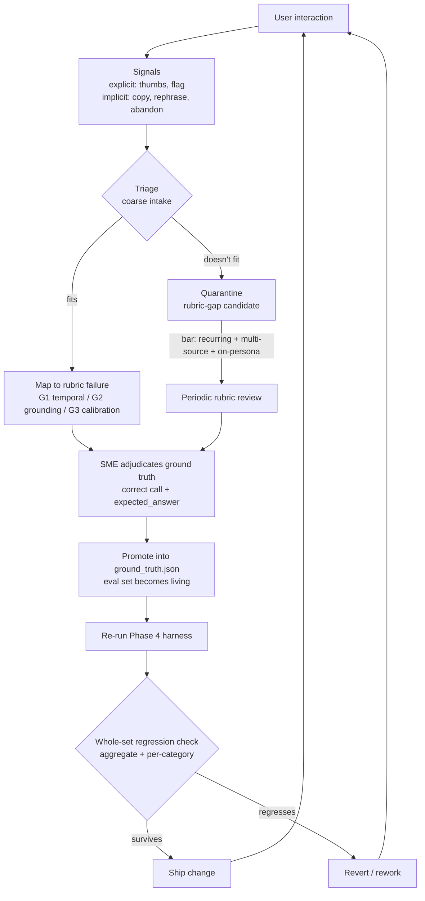

# Trailside — Feedback Loop & Optimization Design

> Phase 5 deliverable. The eval harness (Phase 4) proves quality can be
> *measured*; this doc describes how it gets *improved over time*. Together they
> are the two halves of the same discipline: a static harness tells you where you
> stand today; a feedback loop is how the harness — and the assistant — grow up.

---

## 1. Purpose, and an honest boundary

This is a **designed loop, not a deployed one.** Trailside has no live users
submitting thumbs, so nothing here has run against real feedback traffic. That is
a deliberate framing, not a hole: the claim is not "I collected user
feedback," it's "I designed the loop that turns feedback into measurable
improvement, and every stage of it terminates in an artifact that already exists
in this repo." Signals feed a triage step; triage feeds promotion into
`ground_truth.json`; promotion feeds the Phase 4 harness; the harness produces the
regression diff that decides whether a change ships. The loop is credible because
it closes on a living eval set that is real, on disk, and already caught a
regression this week.

It also keeps one honest guard against self-delusion. I authored the corpus, the
rubric, and the ground-truth set, so I cannot also be the sole judge of whether
the loop's output is "right" — that would just re-encode my own blind spots. The
value of real feedback is that it comes from people who *don't* know the intended
answer and ask things I *didn't* anticipate. Where this project lacks that, the
design names the gap and the mechanism that would close it, rather than pretending
a solo project produced a representative signal.

## 2. What feedback we collect

Feedback splits into two families with very different trust profiles, and the
design point is that **no single signal is trusted on its own.**

**Explicit signals — the backbone.** A thumbs up/down and a lightweight "this
looks wrong" flag. These are rare (most users never rate) but high-precision: a
thumbs-down is a reliable "something is wrong" — though notably *not* a statement
of *what* is wrong or what right would have looked like. This is the cheapest
thing to instrument and the easiest to reason about, so it ships first and anchors
the loop.

**Implicit signals — abundant but uninterpreted.** Behavioral traces: accept,
copy, rephrase, abandon. These are the only read we get on the silent majority who
never file a flag, which is exactly why they matter — but they do not arrive
pre-interpreted, and treating them as if they do is the classic instrumentation
mistake. Two cautions carry real weight here:

- **Copy is a *perceived-usefulness* signal, not a correctness signal.** A user
  copies a confident, fluent, wrong answer as readily as a right one — which is
  precisely the fluent-but-untrustworthy failure mode this whole project exists to
  catch. Rewarding copy as if it meant "correct" would optimize *toward*
  confabulation. So copy is logged as positive engagement and explicitly walled
  off from the quality judgment.
- **Rephrase and abandon are high-value but ambiguous.** A near-identical re-ask
  is a strong silent signal the first answer failed; an abandonment might mean
  "the answer was so bad I gave up" or "I got exactly what I needed and left."
  These cannot be interpreted without **conversation traces** to learn which is
  which. So they are *designed-but-deferred*: instrumented, but not trusted as
  failure signals until each has been **calibrated against explicit ground truth**
  on real traffic. That earns the right to trust an implicit signal rather than
  assuming it.

The sequencing itself is the senior move: explicit now, implicit deferred pending
calibration, copy fenced off from correctness. The feedback gap becomes a
disciplined roadmap decision, not a missing feature.

## 3. Triage — from raw signal to actionable failure

A thumbs-down is worthless until it is classified. Triage is a **default plus
escape-hatch** design with a coarse intake layer and a precise one.

**Map down to a rubric failure category — the default.** Most legitimate failures
fit an axis the harness already scores. A raw complaint is classified into the
rubric's existing gate structure: a temporal-correctness miss (**G1**), a
grounding / fabrication miss (**G2**), or a mis-calibrated call — over-confident
vs. over-cautious (**G3**). This is the same split the Phase 4 confusion matrix
and over-confidence/over-caution error breakdown already produce, which means
feedback and eval speak one language: a triaged failure lands in a bucket the
harness can immediately re-score.

**Quarantine as a rubric-gap candidate — the escape hatch.** A failure that won't
fit any existing category is *not* noise to discard. Because the rubric was
authored against an adversarial set I wrote, it is guaranteed to have blind spots
that only out-of-distribution, real-user questions will expose. An un-mappable
item routes to a periodic "does the rubric need a new dimension?" review. The size
and growth rate of the quarantine pile is itself a health metric: a growing
residue means the standard is drifting out of date with reality.

**The rubric-revision bar — so the escape hatch isn't abused.** The quarantine
path is exactly where over-fitting sneaks in, so revising the rubric requires a
bar: **recurring, from multiple sources, and consistent with the persona.** A
single loud user demanding foraging advice (deliberately out-of-scope per rubric
§4) is a *scope* complaint, not a rubric-gap signal; conflating the two would let
a vocal minority erode boundaries the persona depends on. "Didn't fit" is not
sufficient — "recurring, representative, on-persona, and didn't fit" is.

**Triage is also a prioritization filter.** The next stage (SME adjudication) is
the expensive, rate-limiting step in the whole loop — expert time is scarce, while
thumbs are effectively infinite. So triage does double duty: it classifies *and*
it decides which flagged failures are worth an expert's attention, letting
recurring, high-traffic, and rubric-gap candidates jump the queue. Framing triage
as protecting a scarce resource is the practical PM read on it.

## 4. ⭐ Promotion — how eval goes from static to living

This is the mechanism that unifies evaluation and optimization: **flagged failures
get promoted into the ground-truth set, so the eval set grows from a fixed
snapshot into a living asset that tracks real failure modes.**

Promotion is a two-role handoff, and separating the roles is the point:

- **PM / system: flag and triage.** Detects the failure, classifies it (rubric
  category vs. scope complaint vs. rubric gap), and prioritizes it against scarce
  expert time. This is loop ownership and quality-bar ownership.
- **Subject-matter expert: adjudicate ground truth.** Given the question, the
  *actual retrieved context*, and the response, the SME defines the correct call
  (answer / hedge / redirect / refuse) and the `expected_answer` reference. A
  user flag says "this was wrong" but rarely says what right looks like — someone
  who knows the domain has to author truth.

The separation matters for a specific reason: if the same person both flags *and*
defines truth, the loop simply re-encodes that person's blind spots — the same
circularity that makes rating one's own outputs worthless. An independent SME
breaks the circle. **Honest note for this project:** on Trailside I played both
roles by necessity, because it is a solo build. At enterprise scale these separate —
the PM owns the loop and the quality bar; a domain SME (a superintendent, a
spec expert) adjudicates whether a given RFI or submittal answer is actually
correct. A PM cannot be the arbiter of drywall-spec truth, which is the entire
reason grounding and provenance exist. Naming that separation is how the loop
scales off my own desk.

Once the SME authors it, the promoted record enters `ground_truth.json` with the
same nine-field schema as every hand-authored record, and the Phase 4 harness
re-scores it on the next run like any other case. The static set becomes living.

**Worked example (a real one).** The Phase 4 regression was a genuine failure that
entered this loop honestly — caught by the harness rather than a user, which the
doc states plainly. Loosening system-prompt rule 2 to answer bloom-timing
questions more confidently *looked* like a clean win (exact-match 38.5% → 55.8%,
gate-pass 36.5% → 48.1%). But **GT-013 — "is the lupine out yet?", the rubric §7
hero case — flipped from a correct hedge to a confidently wrong live-certainty
answer**, a G3 failure. That is exactly the kind of defect that, in production,
would arrive as a thumbs-down, get triaged as a G3 over-confidence miss, and be
promoted (or in this case, already sits) in the ground-truth set as the canonical
example of the failure the whole project exists to catch.

## 5. Change control — the guardrail against over-reacting

Given that every signal is noisy and self-selected, this section is the discipline
for **when a change is actually justified, and how to avoid fixing one thing while
silently breaking another.** There are two distinct traps, one for each direction
of error, held together by a single principle: *no single signal — user or metric
— is the sole arbiter of "good."*

**Trap 1 — the vocal minority (a sampling-bias problem).** Feedback is
self-selected; the people who bother to flag skew toward the angriest and the
edge-case users. Optimizing toward whoever shouts drifts the product toward a loud
fringe while the median user — who silently got a fine answer and left — has no
vote. The guardrail is the **representativeness bar**: weight a failure by how
*common* it is, not how *loudly* it's reported. This is also why the noisy implicit
signals still matter: they are the only window onto the silent majority.

A precision worth stating, because it changes the bar: **growing the eval set is
cheap and low-risk; changing the system to chase a score is not.** A genuine
failure belongs in the held-out eval set almost regardless of how rare it is —
more coverage is good. The representativeness bar therefore gates *system changes*
(prompt edits, corpus edits, rubric revisions), **not** eval-set growth. Rare-but-
real failures still get added to eval; they just shouldn't, on their own, trigger
a prompt rewrite.

**Trap 2 — over-fitting to the eval set (a Goodhart problem).** Once a failure
becomes a record you optimize against, you can raise its score in a way that
quietly breaks others — the metric goes up while real quality goes down. The
guardrail is that **every fix is validated against the whole held-out set, never
just the record that prompted it**, and both aggregate *and* per-category numbers
are watched, because an aggregate gain can mask a per-category collapse.

This is not hypothetical: the lupine change is Trap 2 caught red-handed. The
targeted metric jumped, and only the whole-set regression run surfaced that
`place_time_blooms` improving had cost the hero case and pushed over-confidence
errors 15 → 19. A scalar-only report would have shipped it. The regression diff
reverted it. That is the guardrail working.

**In one line:** act on a failure only when it is recurring and representative
(defends against Trap 1), and validate every fix against the entire set before
shipping (defends against Trap 2). "Good" is not one number from one source — it
is a change that survives both checks.

## 6. The loop

The single most important edge is the loop back from the regression gate to the
user: a change only re-enters the product if it survived the whole-set check.
Everything upstream is about deciding *what* to change; that gate is about making
sure a fix for one user doesn't quietly cost the rest.

---

## Mapping to enterprise assistant work (why this is the optimization half of the story)

Enterprise AI-assistant work commonly calls for the same things, nearly verbatim:
"establish feedback loops that continuously improve AI quality," "use product
analytics, customer feedback, model evaluation, and support signals to guide
roadmap," and "human-in-the-loop review / escalation paths." This doc is the design
answer to all three: a loop that
continuously improves quality (§4), a disciplined stance that analytics arrive
uninterpreted and must be calibrated (§2), and an explicit human-in-the-loop SME
role with the PM owning the bar (§4). The honest through-line — that no single
signal is the arbiter, and that a targeted fix must survive a whole-set regression
before it ships — is the same trust discipline whether the corpus is wildflowers
or submittals.
